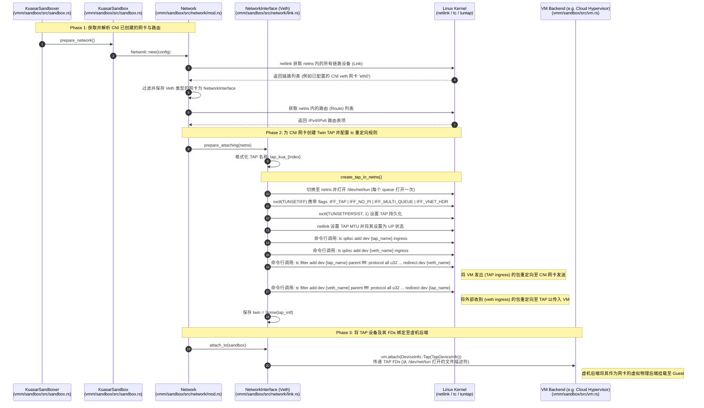
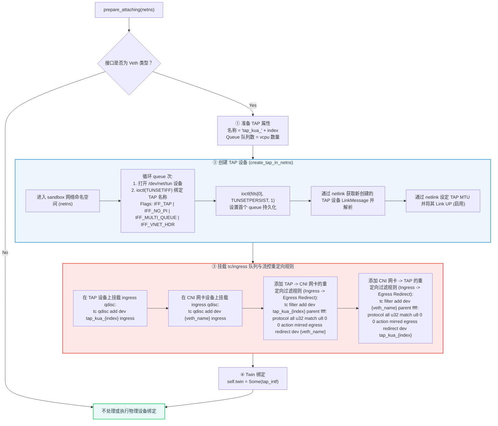
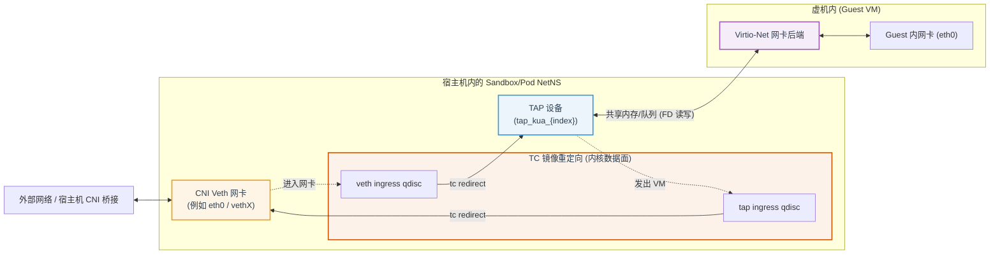

# Kuasar vmm-sandboxer 网络机制：CNI 虚机网络虚拟化与 tc 重定向

本篇文档详细介绍了 Kuasar `vmm-sandboxer` 组件中基于 CNI 网络空间创建 TAP 设备以及挂载 `tc` 规则进行双向流量镜像重定向（Redirect）的完整流程。

---

## 1. 整体流程图 (Overall Sequence Diagram)

---

## 2. TAP 创建与 tc 重定向配置详细子流程 (TAP & tc Setup Flow)

---

## 3. 网络拓扑与双向数据转发路径 (Data Plane Topology)

在 Kuasar 虚机网络模型中，TAP 设备与 CNI 虚拟网卡（Veth）通过 `tc mirred` 机制完成了内核二层的回环流控转发。外部网络与 VM Guest 内部的通讯路径如下：

---

## 4. 关键组件与代码映射 (Key Components & Code Mapping)

| 阶段 / 动作 | 核心类与方法 | 关联源文件 | 关键职责描述 |
| :--- | :--- | :--- | :--- |
| **准备网络** | `KuasarSandboxer::start` | [sandbox.rs:L260-268](https://github.com/kuasar-io/kuasar/blob/main/vmm/sandbox/src/sandbox.rs#L260-L268) | 若 `netns` 不为空，则触发 `prepare_network` |
| **配置网络** | `KuasarSandbox::prepare_network` | [sandbox.rs:L789-808](https://github.com/kuasar-io/kuasar/blob/main/vmm/sandbox/src/sandbox.rs#L789-L808) | 收集网卡 Queue 数（对应 vcpu 数量），实例化 `Network` 并执行网卡及路由的挂载绑定 |
| **CNI 解析** | `Network::new_in_netns` | [mod.rs:L88-126](https://github.com/kuasar-io/kuasar/blob/main/vmm/sandbox/src/network/mod.rs#L88-L126) | 用 netlink 扫描 netns，调用 `NetworkInterface::parse_from_message` 并解析已由 CNI 创建好的 Veth / IP 地址 / 路由表 |
| **触发附加** | `Network::attach_to` | [mod.rs:L128-137](https://github.com/kuasar-io/kuasar/blob/main/vmm/sandbox/src/network/mod.rs#L128-L137) | 对遍历到的每个网卡，依次执行 `prepare_attaching` 和 `attach_to` |
| **流控规则设置** | `NetworkInterface::prepare_attaching` | [link.rs:L312-331](https://github.com/kuasar-io/kuasar/blob/main/vmm/sandbox/src/network/link.rs#L312-L331) | 入口函数：对 Veth 驱动网卡，调用 `create_tap_in_netns` 生成 TAP 设备并调用 `tc` 命令行工具配置双向 `ingress redirect` 规则 |
| **TAP 创建器** | `create_tap_in_netns` | [link.rs:L483-516](https://github.com/kuasar-io/kuasar/blob/main/vmm/sandbox/src/network/link.rs#L483-L516) | 封装在 netns 内新建 TAP、设置 MTU 并开启接口的动作 |
| **系统底层绑定** | `create_tap_device` | [link.rs:L526-565](https://github.com/kuasar-io/kuasar/blob/main/vmm/sandbox/src/network/link.rs#L526-L565) | 底层系统调用：多次打开 `/dev/net/tun` 并通过 `ioctl(TUNSETIFF)` 与 `ioctl(TUNSETPERSIST)` 持久化 TAP 描述符并获取 FDs 向量 |
| **tc ingress 挂载** | `add_qdisc_ingress` | [link.rs:L397-403](https://github.com/kuasar-io/kuasar/blob/main/vmm/sandbox/src/network/link.rs#L397-L403) | 执行 `tc qdisc add dev {name} ingress` |
| **tc 重定向过滤** | `add_redirect_tc_filter` | [link.rs:L405-432](https://github.com/kuasar-io/kuasar/blob/main/vmm/sandbox/src/network/link.rs#L405-L432) | 执行 `tc filter add ... action mirred egress redirect` 进行网卡到 TAP 设备的对流映射 |
| **绑定至 VM 后端** | `NetworkInterface::attach_to` | [link.rs:L333-388](https://github.com/kuasar-io/kuasar/blob/main/vmm/sandbox/src/network/link.rs#L333-L388) | 获取 TAP 设备的 Twin 对象，并调用 `sandbox.vm.attach` 把包含该 TAP 所有 FDs 的 `TapDeviceInfo` 移交给 VM 后端驱动。 |
